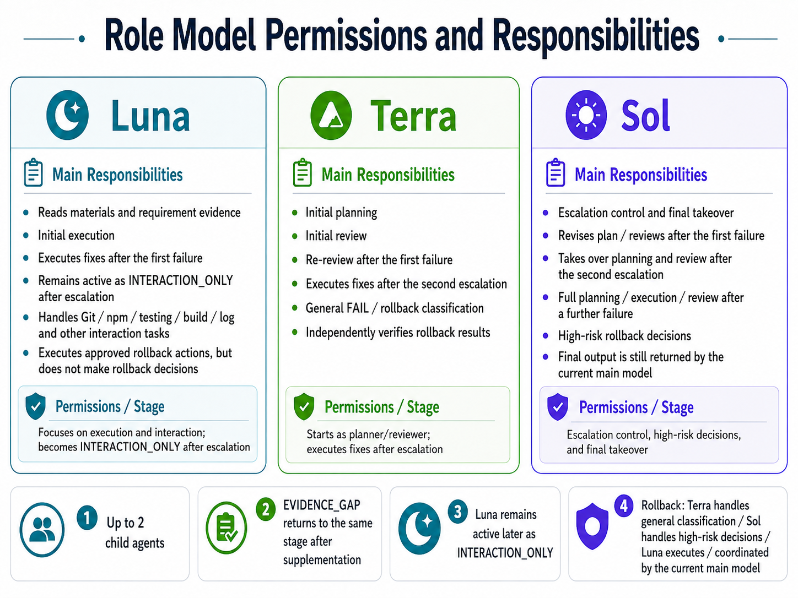
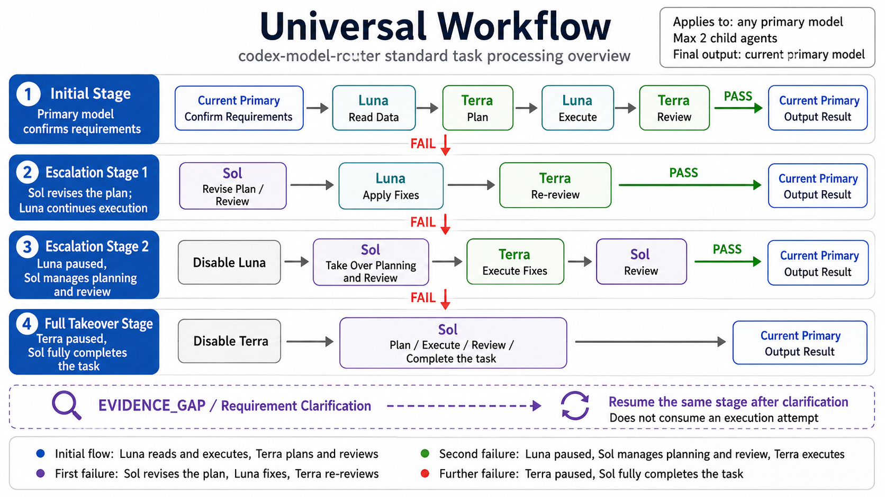
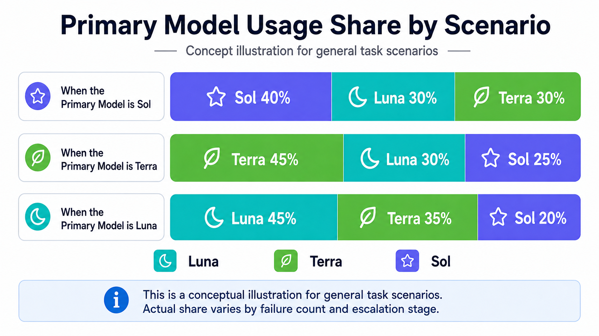
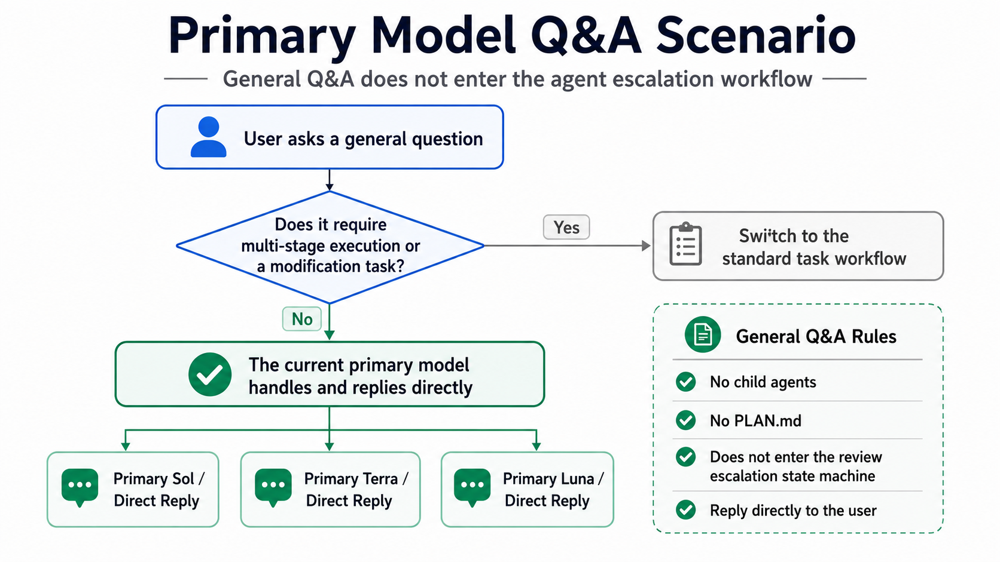
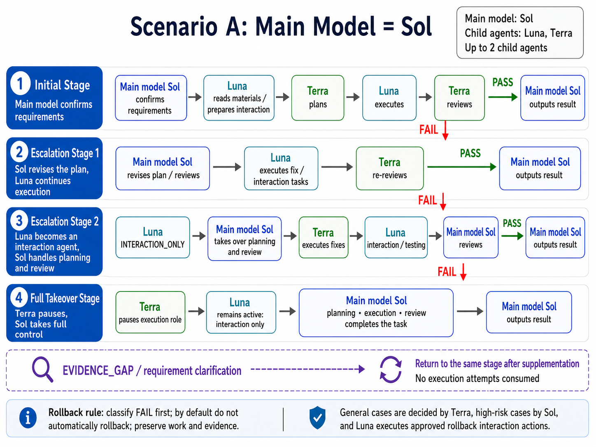
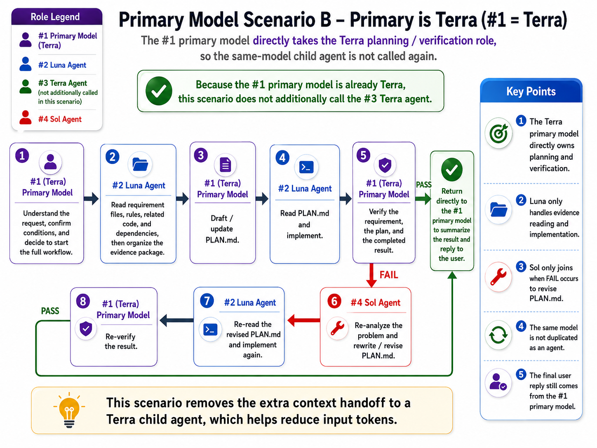
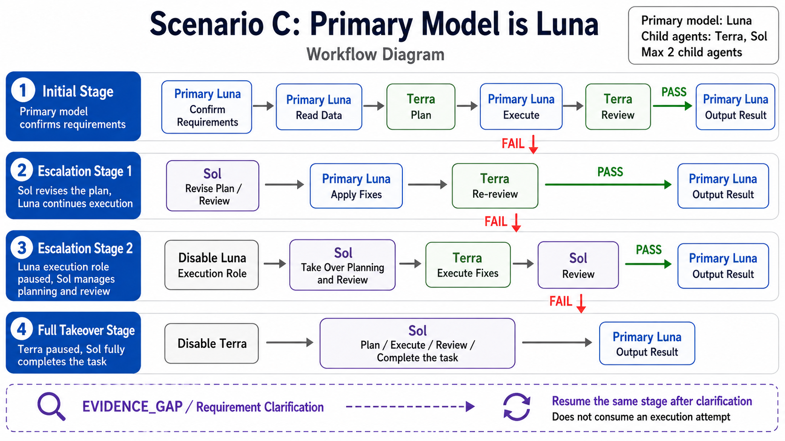

# codex-model-router

[繁體中文](README.md)｜[English](README.en.md)

Installs an evidence-first Codex workflow for Terra, Luna, and Sol while preserving the user's primary model and unrelated Codex configuration.

> Routing is advisory. Codex reads the installed agents and skills and decides when to delegate. This package does not intercept prompts or guarantee a hard model switch.

## Install

Project:

```sh
npx codex-model-router@latest install
```

Current user:

```sh
npx codex-model-router@latest install --global
```

Enable package-managed multi-agent V2:

```sh
npx codex-model-router@latest install --v2
```

Use `--global --v2` for the current user. Restart Codex after installation.

### Codex installation locations

| Scope | Agent definitions | User skills |
| --- | --- | --- |
| Project | `<project>/.codex/agents` | `<project>/.codex/skills` |
| Current user | `~/.codex/agents` | `~/.codex/skills` |

Skills are always installed under the applicable Codex root at `.codex/skills/<skill-name>`; `.codex/skills/.system` remains reserved for bundled Codex skills. Reinstalling from an older release safely migrates package-managed skills from `.agents/skills`. The CLI prints the resolved agent and skill locations after installation.

## Configuration

```sh
npx codex-model-router@latest install \
  --terra-reasoning high \
  --luna-reasoning xhigh \
  --sol-reasoning medium \
  --terra-fast
```

| Option | Purpose |
| --- | --- |
| `--set-default` | Set Terra/high as the primary default |
| `--agent-reasoning <level>` | Set reasoning for all managed agents |
| `--terra-reasoning <level>` | Set Terra reasoning |
| `--luna-reasoning <level>` | Set Luna reasoning |
| `--sol-reasoning <level>` | Set Sol reasoning |
| `--agent-fast` / `--no-agent-fast` | Set Fast preference for all managed child roles; role options take precedence |
| `--terra-fast` / `--no-terra-fast` | Set Terra Fast preference |
| `--luna-fast` / `--no-luna-fast` | Set Luna Fast preference |
| `--sol-fast` / `--no-sol-fast` | Set Sol Fast preference |
| `--v2` | Enable or repair package-managed V2 |
| `--global` | Apply the installation to the current user |

Reasoning values: `none`, `low`, `medium`, `high`, `xhigh`, `max`.

Fast and reasoning are independent settings, retained only for the same child role; neither affects the primary nor another role. Run `npx codex-model-router@latest status [--global]` to view configured and effective values. Codex currently exposes no per-agent Fast runtime control, so `configured=true` explicitly reports `effective=not-supported`; the installer never enables global `fast_mode` or maps Fast to reasoning.

## Visual guides

All diagrams are collapsed by default. Select a heading to expand it.

<details>
<summary><strong>Roles, models, access, and responsibilities</strong></summary>



</details>

<details>
<summary><strong>Standard main workflow overview</strong></summary>



</details>

<details>
<summary><strong>Estimated model usage share</strong></summary>



</details>

<details>
<summary><strong>Primary-model Q&A outside the workflow</strong></summary>



</details>

<details>
<summary><strong>Scenario A: Primary is Sol</strong></summary>



</details>

<details>
<summary><strong>Scenario B: Primary is Terra</strong></summary>



</details>

<details>
<summary><strong>Scenario C: Primary is Luna</strong></summary>



</details>

## Core rules

- The same model is not spawned twice in one workflow.
- A matching primary model performs that role in the primary thread.
- Luna, Terra, and Sol have write capability, but stage and execution flags gate every write; Terra and pre-takeover Sol return plan/review content without writing a plan artifact.
- Terra plans and independently verifies.
- Sol joins only after a non-PASS verification result.
- The final response always returns through the primary model.

## Workflow recovery contract

Recovery is a declarative host-consumed contract; this package provides no JavaScript runtime API, CLI, or child-process persistence. The host supplies valid roles, the current primary, the executor, and topology. More than two child slots must produce `EVIDENCE_GAP` with no unproven action.

The state file is fixed at `RECOVERY_STATE_PATH=<ARTIFACT_DIR>/recovery-state.v1.json`. The registry is root-level `{version?, root_session_id, workflow_id, agents:{[role]:{agent_id,status,handoff}}, diagnostics?}`; `agents` is an object keyed by role, never an array, and nested `root`/`workflow` objects are forbidden. Use exact IDs only; unknown or ambiguous IDs are never replaced. Same-primary, disabled, invalid (policy-invalid), primary-switch, and excess instances are `removed-by-policy`; every saved instance has exactly one result: `reused`, `replaced`, `removed-by-policy`, `resume-failed`, `not-supported`, `stale-workflow`, or `invalid-agent-id`.

Replacement requires a host-confirmed missing, closed, invalid, per-instance unsupported, or resume-failed condition, explicit host creation, and policy permission; the handoff is copied unchanged. The primary thread, regardless of selected model, owns registry loading, atomic persistence, and runtime coordination; Terra/Sol child roles and planning are registry read-only, while the active writable executor owns plan-artifact persistence and cleanup. Write through an atomic sibling-file flush, close, and rename sequence; any failure retains the prior registry, publishes no partial state, and prevents dependent actions. These are template contract fixtures, not live E2E.

## Workflow escalation state machine

Each task also persists task-scoped state at `WORKFLOW_STATE_PATH=<ARTIFACT_DIR>/workflow-state.v1.json`, separate from the recovery registry. State includes workflow/root IDs, requirement/evidence/plan versions, current stage, latest verdict, primary model, Sol review failures, Terra execution attempts, all three execution flags, active role IDs, ownership for every role, and `blocked_reason`. A same-workflow primary switch preserves versions, counters, stage, verdict, and disabled flags; a new workflow creates fresh initial state.

Stages are monotonic: `INITIAL` → `SOL_REPLAN_WITH_LUNA` → `SOL_PLAN_REVIEW_WITH_TERRA` → `SOL_FULL_TAKEOVER`. `PASS` terminates; `EVIDENCE_GAP` and `REQUIREMENT_CLARIFICATION` remain in the same stage without an attempt or counter increment; only `FAIL_PLAN` and `FAIL_IMPLEMENTATION` advance. Luna/Terra primaries begin with Terra planning/review and Luna execution; primary Sol INITIAL has no Luna child and uses Terra as the only child executor. After Luna is permanently disabled, Terra may execute at most twice; a further failure permanently disables Terra and gives Sol full takeover.

All role TOML files have workspace-write capability, but stage and flags gate writes: Sol is read-only before `SOL_FULL_TAKEOVER`, and a disabled primary remains coord-only permanently. There are at most two children, no child matching the primary model, and spawning occurs only when required by the stage. The primary thread performs atomic flush/close/rename; failure retains prior state, publishes no partial state, and performs no dependent action. This is a declarative host contract, not a runtime API, CLI, or live E2E implementation.

## Plan-artifact lifecycle

Each workflow uses the selected scope's `<CODEX_ROOT>/model-router/workflows/<workflow_id>/PLAN.md`; it never writes to source files or scans another workflow. State records `plan_path`, artifact/cleanup owner, cleanup required, and artifact status. Terra and pre-takeover Sol return complete content or a delta, while only the active writable executor atomically persists or updates it. `INITIAL` uses the active executor, `SOL_REPLAN_WITH_LUNA` uses Luna, the post-Luna `SOL_PLAN_REVIEW_WITH_TERRA` stage uses Terra, and `SOL_FULL_TAKEOVER` uses Sol. Without a writable role, the result is an in-memory artifact, never a false file-write claim.

After PASS and required evidence preservation, the same cleanup owner removes only that exact workflow directory. Cancellation, blocking, resume, replacement, and primary switches preserve its path, version, and ownership; a new workflow gets a new directory. A failed cleanup is persisted and reported as `cleanup-failed`; `retained` is used only when retention is explicit.

## V2

```text
install --v2  → enable V2; repair a modified or missing tracked marker block
install       → disable unchanged package-managed V2
uninstall     → remove the router and unchanged managed V2
```

When `install --v2` is explicitly run again and package state still exists, a changed or missing package-marked V2 block is rebuilt, its hash is updated, and unrelated TOML is preserved. Pre-existing unmanaged V2, missing state, incomplete markers, or duplicate markers remain preserved and stop the operation to prevent accidental overwrites.

## Remove

Project:

```sh
npx codex-model-router@latest uninstall
```

Current user:

```sh
npx codex-model-router@latest uninstall --global
```

## Safety

- Preserves unrelated TOML, comments, BOM, ordering, and LF/CRLF.
- Uses path validation, scope locking, atomic transactions, and rollback.
- Except for rebuilding the package-marked V2 block after an explicit `install --v2`, it never overwrites other user-modified managed files.
- Never changes `AGENTS.md`, shell profiles, editor settings, hooks, MCP servers, accounts, telemetry, or environment variables.

## Requirements

- Node.js 18 or newer.
- Codex with custom-agent and local-skill support.
- Access to `gpt-5.6-terra`, `gpt-5.6-luna`, and `gpt-5.6-sol`.
- Windows, Linux, or macOS.

Security issues: see [SECURITY.md](SECURITY.md). Maintainer release steps: see [MAINTAINERS.md](MAINTAINERS.md).
