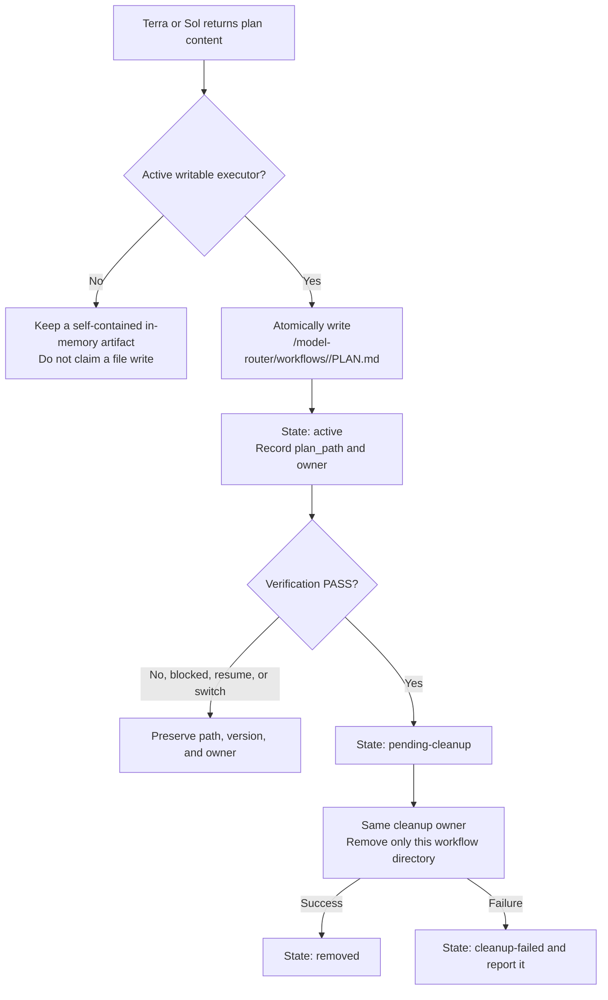

# codex-model-router

[繁體中文](README.md)｜[English](README.en.md)

Installs an evidence-first Codex workflow for Terra, Luna, and Sol while preserving the user's primary model and unrelated Codex configuration.

> Routing is advisory. Codex reads the installed agents and skills and decides when to delegate. This package does not intercept prompts or guarantee a hard model switch.

## Install

Project:

```sh
npx codex-model-router@latest install
```

Current user:

```sh
npx codex-model-router@latest install --global
```

Enable package-managed multi-agent V2:

```sh
npx codex-model-router@latest install --v2
```

Use `--global --v2` for the current user. Restart Codex after installation.

### Codex installation locations

| Scope | Agent definitions | User skills |
| --- | --- | --- |
| Project | `<project>/.codex/agents` | `<project>/.codex/skills` |
| Current user | `~/.codex/agents` | `~/.codex/skills` |

Skills are installed under `.codex/skills/<skill-name>`; reinstalling safely migrates package-managed legacy skills and prints the resolved paths.

## Configuration

```sh
npx codex-model-router@latest install \
  --terra-reasoning medium \
  --luna-reasoning xhigh \
  --sol-reasoning medium \
  --terra-fast
```
When `--terra-reasoning` is omitted, managed Terra children default to `medium`.

| Option | Purpose |
| --- | --- |
| `--set-default` | Set Terra/high as the primary default |
| `--agent-reasoning <level>` | Set reasoning for all managed agents |
| `--terra-reasoning <level>` | Set Terra reasoning |
| `--luna-reasoning <level>` | Set Luna reasoning |
| `--sol-reasoning <level>` | Set Sol reasoning |
| `--agent-fast` / `--no-agent-fast` | Set Fast preference for all managed child roles; role options take precedence |
| `--terra-fast` / `--no-terra-fast` | Set Terra Fast preference |
| `--luna-fast` / `--no-luna-fast` | Set Luna Fast preference |
| `--sol-fast` / `--no-sol-fast` | Set Sol Fast preference |
| `--v2` | Enable or repair package-managed V2 |
| `--global` | Apply the installation to the current user |

Reasoning values: `none`, `low`, `medium`, `high`, `xhigh`, `max`.

Fast and reasoning are independent and retained only for the same child role. Use `status [--global]` to view them; Codex currently has no per-child Fast runtime control, so `configured=true` reports `effective=not-supported`.

## Visual guides

All diagrams are collapsed by default. Select a heading to expand it.

<details>
<summary><strong>Roles, models, access, and responsibilities</strong></summary>


</details>

<details>
<summary><strong>Standard main workflow overview</strong></summary>


</details>

<details>
<summary><strong>Plan-artifact persistence and cleanup</strong></summary>



</details>

<details>
<summary><strong>Estimated model usage share</strong></summary>


</details>

<details>
<summary><strong>Primary-model Q&A outside the workflow</strong></summary>


</details>

<details>
<summary><strong>Scenario A: Primary is Sol</strong></summary>


</details>

<details>
<summary><strong>Scenario B: Primary is Terra</strong></summary>


</details>

<details>
<summary><strong>Scenario C: Primary is Luna</strong></summary>


</details>

## Core rules

- The same model is not spawned twice in one workflow.
- A matching primary model performs that role in the primary thread.
- Stage and Luna mode gate writes; `luna_execution_enabled` is migration-only and cannot replace the mode.
- Terra plans and independently verifies; Sol joins after a non-PASS result.
- Luna keeps the same `luna_role_id` for the root session/workflow; after demotion it runs only stage-authorized canonical action IDs as `INTERACTION_ONLY`.
- The final response always returns through the primary model.

## Workflow contract

This is a declarative host contract; the package does not persist child processes or provide runtime persistence.

### Recovery

- `RECOVERY_STATE_PATH=<ARTIFACT_DIR>/recovery-state.v1.json`; registry `agents` is an object keyed by role.
- The host supplies the primary, executor, and at most two child roles; more than two returns `EVIDENCE_GAP` without mutation.
- Reuse an exact same-workflow Luna ID even after demotion to `INTERACTION_ONLY`. Replace only when the host confirms it is unusable and allows creation; preserve the handoff. Never carry an identity into a new workflow, root session, or workspace.
- The primary thread loads, saves, and coordinates; the active writable executor owns PLAN.md. A write failure keeps the previous state.

### Escalation

Each task stores stage, verdict, counters, flags, and ownership at `WORKFLOW_STATE_PATH=<ARTIFACT_DIR>/workflow-state.v1.json`; a same-task primary switch preserves them.

| Stage | Flow | PLAN.md owner |
| --- | --- | --- |
| `INITIAL` | Primary confirms → Luna reads/executes → Terra plans/reviews | Current writable executor |
| `SOL_REPLAN_WITH_LUNA` | Sol revises → Luna corrects → Terra reviews | Luna |
| `SOL_PLAN_REVIEW_WITH_TERRA` | Retain Luna as `INTERACTION_ONLY`; Sol plans/reviews → Terra executes | Terra |
| `SOL_FULL_TAKEOVER` | Retain Luna as `INTERACTION_ONLY`; disable Terra writes; Sol completes the task | Sol |

`PASS` terminates through the current primary; `EVIDENCE_GAP` and `REQUIREMENT_CLARIFICATION` stay in the same stage without consuming an attempt. No matching-model child is created, at most two children are active, and Stage 4 never re-enables a source executor but may retain Luna as an interaction child.

### Luna interaction modes

| Mode | Authority |
| --- | --- |
| `ACTIVE_EXECUTOR` | Stage-gated source/PLAN writes and authorized work |
| `INTERACTION_ONLY` | No source/PLAN writes, decisions, or self-approval; only host-supplied action IDs |
| `DETACHED` | No actions |

Interaction results include action, command, cwd, exit code, summary, evidence, artifact refs, and redactions; large output belongs in artifacts and secrets are redacted first.

### Verification failure rollback

For `FAIL_PLAN` or `FAIL_IMPLEMENTATION`, preserve valid diffs and evidence, classify the failure, then decide whether rollback is needed; correctable failures default to incremental correction, and unknown untracked files are never deleted automatically.

| Class | Default policy |
| --- | --- |
| `CORRECTABLE` | `NONE`: use existing escalation and preserve valid work |
| `SCOPE_VIOLATION`, `WORKSPACE_POLLUTION` | `SELECTIVE`: touch only identified, verified targets |
| `WORKSPACE_CORRUPTION`, `DEPENDENCY_CORRUPTION`, `UNKNOWN_STATE` | `BLOCK_AND_ESCALATE`: stop advancement and preserve evidence |
| `EXTERNAL_SIDE_EFFECT` | `EXTERNAL_SYSTEM`: complete compensating action first |
| `SECURITY_RISK` | `ISOLATE_AND_ROLLBACK`: isolate, redact, and use an authorized handler |

Evidence and pre-state must be persisted before rollback; a changed target hash becomes `STALE_TARGET`, and partial or failed rollback can never be treated as `PASS`.

### PLAN.md lifecycle

Each workflow uses only `<CODEX_ROOT>/model-router/workflows/<workflow_id>/PLAN.md`. Only the active writable executor writes atomically; reviewers do not write it. After `PASS`, the same owner removes the directory. Blocking, resume, replacement, and primary switches preserve path, version, and owner; cleanup failure is stored as `cleanup-failed`.

## V2

```text
install --v2  → enable V2; repair a modified or missing tracked marker block
install       → disable unchanged package-managed V2
uninstall     → remove the router and unchanged managed V2
```

When `install --v2` is explicitly run again and package state still exists, a changed or missing package-marked V2 block is rebuilt, its hash is updated, and unrelated TOML is preserved. Pre-existing unmanaged V2, missing state, incomplete markers, or duplicate markers remain preserved and stop the operation to prevent accidental overwrites.

## Remove

Project:

```sh
npx codex-model-router@latest uninstall
```

Current user:

```sh
npx codex-model-router@latest uninstall --global
```

## Safety

- Preserves unrelated TOML, comments, BOM, ordering, and LF/CRLF.
- Uses path validation, scope locking, atomic transactions, and rollback.
- Except for rebuilding the package-marked V2 block after an explicit `install --v2`, it never overwrites other user-modified managed files.
- Never changes `AGENTS.md`, shell profiles, editor settings, hooks, MCP servers, accounts, telemetry, or environment variables.

## Requirements

- Node.js 18 or newer.
- Codex with custom-agent and local-skill support.
- Access to `gpt-5.6-terra`, `gpt-5.6-luna`, and `gpt-5.6-sol`.
- Windows, Linux, or macOS.

Security issues: see [SECURITY.md](SECURITY.md). Maintainer release steps: see [MAINTAINERS.md](MAINTAINERS.md).
