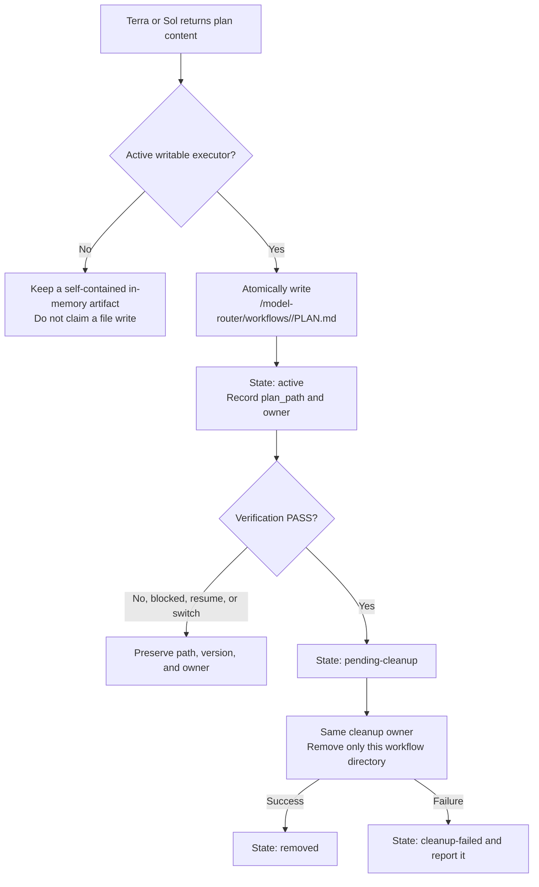

# codex-model-router

[繁體中文](README.md)｜[English](README.en.md)

Installs an evidence-first Codex workflow for Terra, Luna, and Sol while preserving the user's primary model and unrelated Codex configuration.

> Routing is advisory. Codex reads the installed agents and skills and decides when to delegate. This package does not intercept prompts or guarantee a hard model switch.

## Install

Project:

```sh
npx codex-model-router@latest install
```

Current user:

```sh
npx codex-model-router@latest install --global
```

Enable package-managed multi-agent V2:

```sh
npx codex-model-router@latest install --v2
```

Use `--global --v2` for the current user. Restart Codex after installation.

### Codex installation locations

| Scope | Agent definitions | User skills |
| --- | --- | --- |
| Project | `<project>/.codex/agents` | `<project>/.codex/skills` |
| Current user | `~/.codex/agents` | `~/.codex/skills` |

Skills are always installed under the applicable Codex root at `.codex/skills/<skill-name>`; `.codex/skills/.system` remains reserved for bundled Codex skills. Reinstalling from an older release safely migrates package-managed skills from `.agents/skills`. The CLI prints the resolved agent and skill locations after installation.

## Configuration

```sh
npx codex-model-router@latest install \
  --terra-reasoning high \
  --luna-reasoning xhigh \
  --sol-reasoning medium \
  --terra-fast
```

| Option | Purpose |
| --- | --- |
| `--set-default` | Set Terra/high as the primary default |
| `--agent-reasoning <level>` | Set reasoning for all managed agents |
| `--terra-reasoning <level>` | Set Terra reasoning |
| `--luna-reasoning <level>` | Set Luna reasoning |
| `--sol-reasoning <level>` | Set Sol reasoning |
| `--agent-fast` / `--no-agent-fast` | Set Fast preference for all managed child roles; role options take precedence |
| `--terra-fast` / `--no-terra-fast` | Set Terra Fast preference |
| `--luna-fast` / `--no-luna-fast` | Set Luna Fast preference |
| `--sol-fast` / `--no-sol-fast` | Set Sol Fast preference |
| `--v2` | Enable or repair package-managed V2 |
| `--global` | Apply the installation to the current user |

Reasoning values: `none`, `low`, `medium`, `high`, `xhigh`, `max`.

Fast and reasoning are independent settings, retained only for the same child role; neither affects the primary nor another role. Run `npx codex-model-router@latest status [--global]` to view configured and effective values. Codex currently exposes no per-agent Fast runtime control, so `configured=true` explicitly reports `effective=not-supported`; the installer never enables global `fast_mode` or maps Fast to reasoning.

## Visual guides

All diagrams are collapsed by default. Select a heading to expand it.

<details>
<summary><strong>Roles, models, access, and responsibilities</strong></summary>


</details>

<details>
<summary><strong>Standard main workflow overview</strong></summary>


</details>

<details>
<summary><strong>Plan-artifact persistence and cleanup</strong></summary>



</details>

<details>
<summary><strong>Estimated model usage share</strong></summary>


</details>

<details>
<summary><strong>Primary-model Q&A outside the workflow</strong></summary>


</details>

<details>
<summary><strong>Scenario A: Primary is Sol</strong></summary>


</details>

<details>
<summary><strong>Scenario B: Primary is Terra</strong></summary>


</details>

<details>
<summary><strong>Scenario C: Primary is Luna</strong></summary>


</details>

## Core rules

- The same model is not spawned twice in one workflow.
- A matching primary model performs that role in the primary thread.
- Luna, Terra, and Sol have write capability, but stage and execution flags gate every write; Terra and pre-takeover Sol return plan/review content without writing a plan artifact.
- Terra plans and independently verifies.
- Sol joins only after a non-PASS verification result.
- The final response always returns through the primary model.

## Workflow recovery contract

Recovery is a declarative host contract; the package does not persist child processes or claim runtime persistence.

- State path: `RECOVERY_STATE_PATH=<ARTIFACT_DIR>/recovery-state.v1.json`.
- Registry: root-level `version?`, `root_session_id`, `workflow_id`, `agents`, and `diagnostics?`; `agents` is an object keyed by role, never an array.
- The host supplies the current primary, executor, and at most two valid child roles. More than two returns `EVIDENCE_GAP` with no mutation or runtime action; only supplied roles are inspected and other roles are `removed-by-policy`.
- Reuse an exact resumable ID. Replace only when the host confirms it is unusable, policy allows replacement, and the host can create the replacement; preserve the handoff. Unknown or ambiguous IDs are not replaced.
- The primary thread owns loading, atomic persistence, and coordination; the active writable executor owns PLAN.md. Write with flush, close, and rename; any failure retains the prior registry, publishes no partial state, and performs no dependent action.

## Workflow escalation state machine

Each task stores its state at `WORKFLOW_STATE_PATH=<ARTIFACT_DIR>/workflow-state.v1.json`, separate from the recovery registry. It records versions, stage, verdict, primary, counters, execution flags, role ownership, and `blocked_reason`. A same-task primary switch preserves these values; a new workflow resets them.

The four stages are monotonic:

1. `INITIAL`: the current primary confirms the requirement; Terra plans/reviews and enabled Luna reads/executes.
2. `SOL_REPLAN_WITH_LUNA`: Sol revises the plan, Luna applies the correction, and Terra reviews again.
3. `SOL_PLAN_REVIEW_WITH_TERRA`: Luna execution is disabled; Sol plans/reviews and Terra executes the plan.
4. `SOL_FULL_TAKEOVER`: Terra execution is disabled; Sol reads, plans, implements, reviews, and completes the task.

`PASS` terminates through the current primary; `EVIDENCE_GAP` and `REQUIREMENT_CLARIFICATION` stay in the same stage without consuming an attempt. Primary Sol, Terra, and Luna never create a matching-model child; at most two children are active, and no executor is re-enabled in Stage 4.

## Plan-artifact lifecycle

Each workflow uses `<CODEX_ROOT>/model-router/workflows/<workflow_id>/PLAN.md` and never another workflow's directory.

- `INITIAL`: Terra supplies the plan; the current writable executor stores it. Luna stores it when Luna is the primary, otherwise the Luna child does.
- `SOL_REPLAN_WITH_LUNA`: Sol supplies the revision; enabled Luna stores and cleans it.
- `SOL_PLAN_REVIEW_WITH_TERRA`: Sol supplies the revision; enabled Terra stores and cleans it.
- `SOL_FULL_TAKEOVER`: Sol stores and cleans it.
- With no writable role, keep an in-memory artifact and make no file-write claim.

Only the active writable executor atomically writes or updates PLAN.md; reviewers do not write it. After `PASS`, the same cleanup owner removes that workflow directory. Blocking, resume, replacement, and primary switches preserve its path, version, and owner; cleanup failure is stored as `cleanup-failed`.

## V2

```text
install --v2  → enable V2; repair a modified or missing tracked marker block
install       → disable unchanged package-managed V2
uninstall     → remove the router and unchanged managed V2
```

When `install --v2` is explicitly run again and package state still exists, a changed or missing package-marked V2 block is rebuilt, its hash is updated, and unrelated TOML is preserved. Pre-existing unmanaged V2, missing state, incomplete markers, or duplicate markers remain preserved and stop the operation to prevent accidental overwrites.

## Remove

Project:

```sh
npx codex-model-router@latest uninstall
```

Current user:

```sh
npx codex-model-router@latest uninstall --global
```

## Safety

- Preserves unrelated TOML, comments, BOM, ordering, and LF/CRLF.
- Uses path validation, scope locking, atomic transactions, and rollback.
- Except for rebuilding the package-marked V2 block after an explicit `install --v2`, it never overwrites other user-modified managed files.
- Never changes `AGENTS.md`, shell profiles, editor settings, hooks, MCP servers, accounts, telemetry, or environment variables.

## Requirements

- Node.js 18 or newer.
- Codex with custom-agent and local-skill support.
- Access to `gpt-5.6-terra`, `gpt-5.6-luna`, and `gpt-5.6-sol`.
- Windows, Linux, or macOS.

Security issues: see [SECURITY.md](SECURITY.md). Maintainer release steps: see [MAINTAINERS.md](MAINTAINERS.md).
