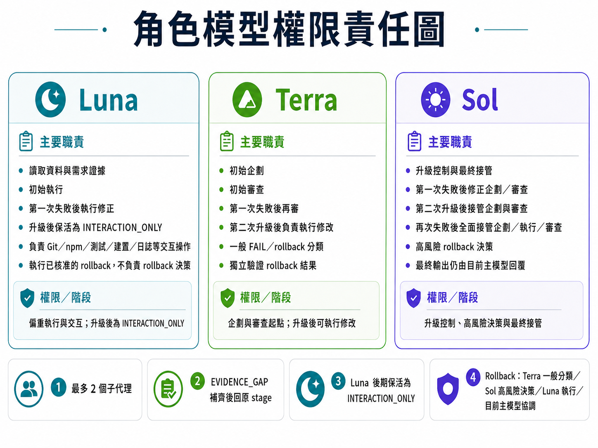
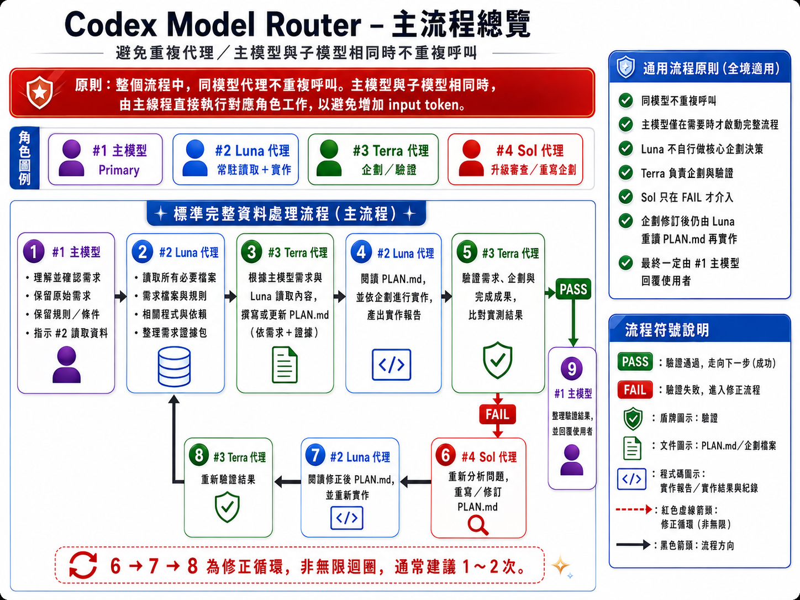
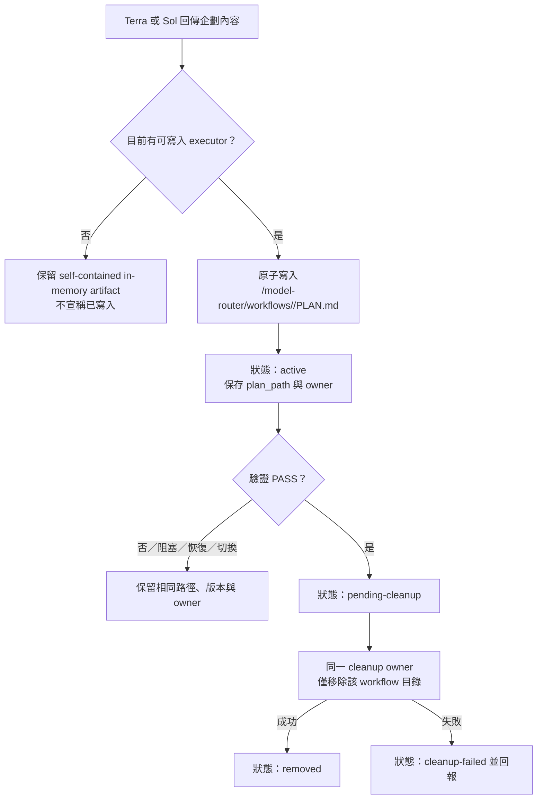
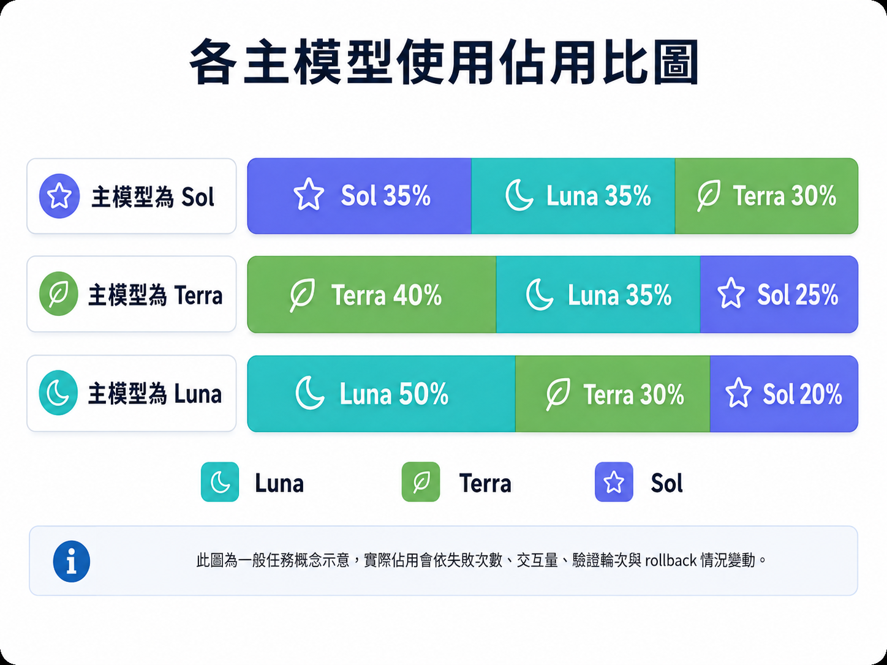
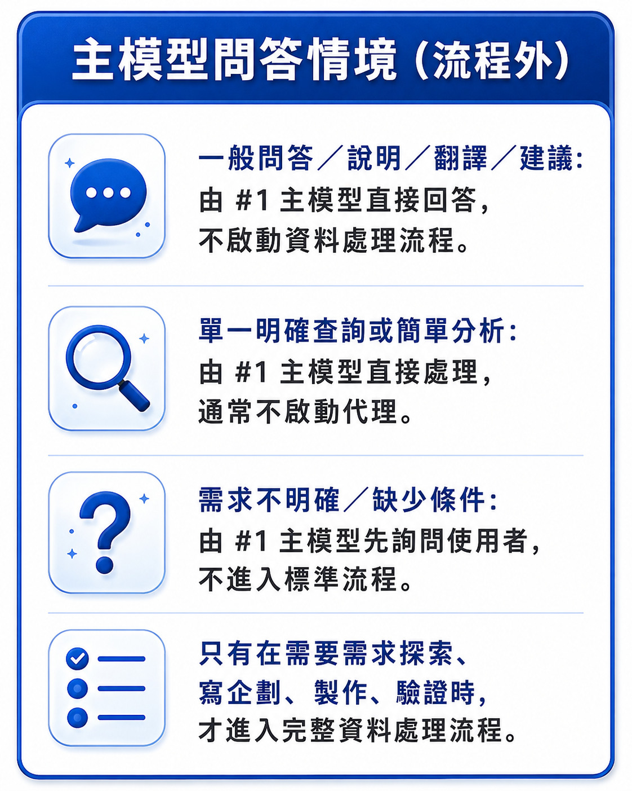
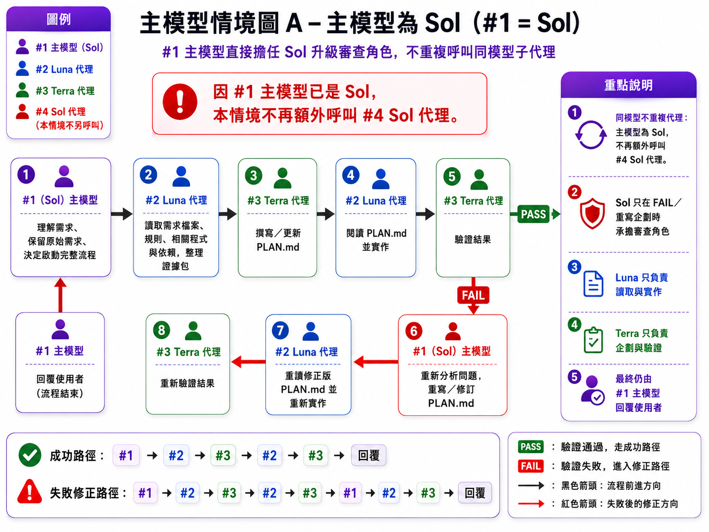
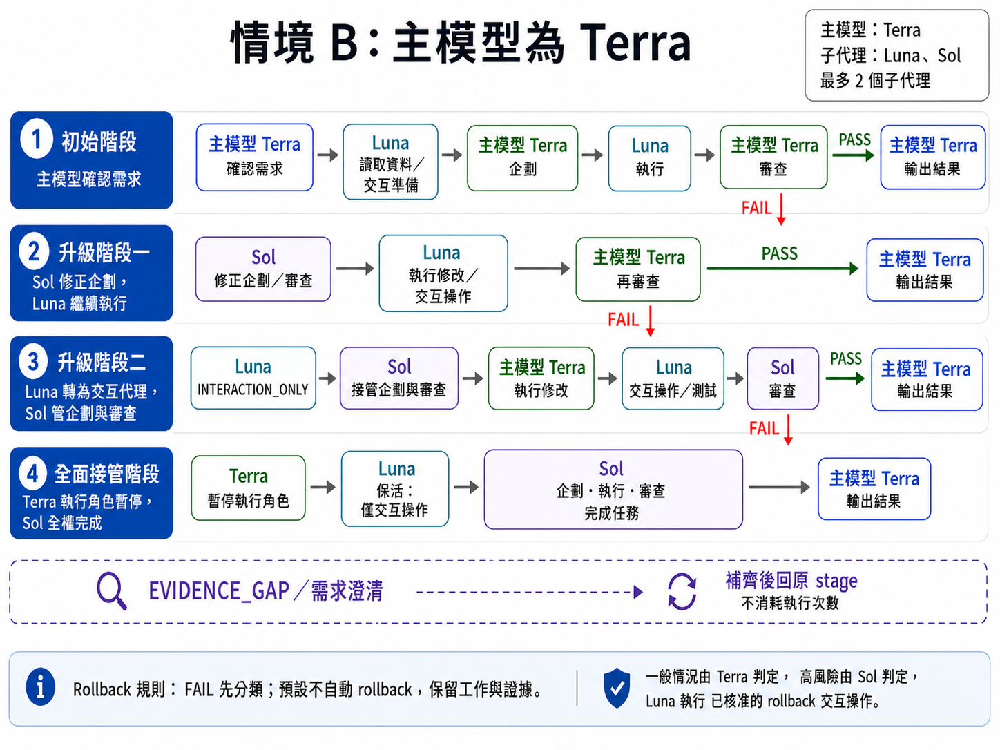
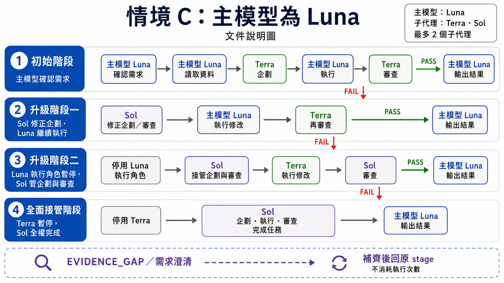

# codex-model-router

[繁體中文](README.md)｜[English](README.en.md)

安裝一套以證據為優先的 Codex 工作流程，由 Terra、Luna 與 Sol 分工，同時保留使用者選擇的主模型與其他無關的 Codex 設定。

> 路由屬於建議性機制。Codex 會讀取已安裝的代理與技能，再自行決定何時委派。本套件不攔截提示詞，也不保證強制切換模型。

## 安裝

安裝到目前專案：

```sh
npx codex-model-router@latest install
```

安裝到目前使用者：

```sh
npx codex-model-router@latest install --global
```

啟用套件管理的多代理 V2：

```sh
npx codex-model-router@latest install --v2
```

目前使用者範圍請搭配 `--global --v2`。安裝完成後重新啟動 Codex。

### Codex 安裝位置

| 範圍 | 代理定義 | 使用者技能 |
| --- | --- | --- |
| 專案 | `<專案>/.codex/agents` | `<專案>/.codex/skills` |
| 目前使用者 | `~/.codex/agents` | `~/.codex/skills` |

技能安裝到對應 Codex 根目錄的 `.codex/skills/<技能名稱>`；重裝時會安全遷移受管理的舊版技能，CLI 會顯示實際路徑。

## 設定

```sh
npx codex-model-router@latest install \
  --terra-reasoning high \
  --luna-reasoning xhigh \
  --sol-reasoning medium \
  --terra-fast
```

| 選項 | 用途 |
| --- | --- |
| `--set-default` | 將 Terra／high 設為預設主模型 |
| `--agent-reasoning <level>` | 設定全部受管理代理的思考等級 |
| `--terra-reasoning <level>` | 設定 Terra 思考等級 |
| `--luna-reasoning <level>` | 設定 Luna 思考等級 |
| `--sol-reasoning <level>` | 設定 Sol 思考等級 |
| `--agent-fast`／`--no-agent-fast` | 對所有受管理子代理設定 Fast 偏好；個別角色選項優先 |
| `--terra-fast`／`--no-terra-fast` | 設定 Terra 的 Fast 偏好 |
| `--luna-fast`／`--no-luna-fast` | 設定 Luna 的 Fast 偏好 |
| `--sol-fast`／`--no-sol-fast` | 設定 Sol 的 Fast 偏好 |
| `--v2` | 啟用或修復套件管理的 V2 |
| `--global` | 套用到目前使用者 |

可用思考等級：`none`、`low`、`medium`、`high`、`xhigh`、`max`。

Fast 與思考等級分開，且只保存到同一個 child role，不影響 primary 或其他角色。用 `status [--global]` 查看設定；目前 Codex 不支援每個 child 的 Fast runtime control，因此 `configured=true` 會顯示 `effective=not-supported`。

## 圖解說明

所有圖表預設摺疊，點擊標題後展開。

<details>
<summary><strong>角色、模型、權限與職責</strong></summary>



</details>

<details>
<summary><strong>標準主流程總覽</strong></summary>



</details>

<details>
<summary><strong>企劃檔持久化與清理流程</strong></summary>



</details>

<details>
<summary><strong>模型使用占比估算</strong></summary>



</details>

<details>
<summary><strong>流程外的主模型問答情境</strong></summary>



</details>

<details>
<summary><strong>情境 A：主模型為 Sol</strong></summary>



</details>

<details>
<summary><strong>情境 B：主模型為 Terra</strong></summary>



</details>

<details>
<summary><strong>情境 C：主模型為 Luna</strong></summary>



</details>

## 核心規則

- 同一個工作流程不重複啟動相同模型代理。
- 主模型與代理角色相同時，由主線程直接完成該角色工作。
- 寫入權由 stage 與 Luna mode 控制；`luna_execution_enabled` 僅供 migration，不能取代 mode。
- Terra 規劃並獨立驗證；Sol 在非 `PASS` 後介入。
- Luna 在同一 root session/workflow 保留同一個 `luna_role_id`；降級後以 `INTERACTION_ONLY` 執行受 stage 授權的 canonical action IDs。
- 最終回覆一律回到主模型。

## 工作流程契約

這是由主機消費的宣告式契約；套件不保存子代理程序，也不提供 runtime persistence。

### 恢復

- `RECOVERY_STATE_PATH=<ARTIFACT_DIR>/recovery-state.v1.json`；registry 的 `agents` 是角色 keyed object。
- Host 提供 primary、executor 與最多兩個 child roles；超過兩個回報 `EVIDENCE_GAP`，不變更狀態。
- 同一 workflow 的精確可恢復 Luna ID 即使降為 `INTERACTION_ONLY` 仍直接 `reused`；只有 host 確認不可用且允許建立新實例時才替換，handoff 原樣保留。新 workflow、root session 或 workspace 不沿用舊身份。
- Primary thread 負責載入、保存與協調；active writable executor 負責 PLAN.md。寫入失敗時保留舊狀態，不發布 partial state。

### 升級流程

每個 task 以 `WORKFLOW_STATE_PATH=<ARTIFACT_DIR>/workflow-state.v1.json` 保存 stage、verdict、計數、flags 與 ownership；同一 task 切換 primary 不重設狀態。

| Stage | 流程 | PLAN.md owner |
| --- | --- | --- |
| `INITIAL` | Primary 確認 → Luna 讀取/執行 → Terra 規劃/審查 | Current writable executor |
| `SOL_REPLAN_WITH_LUNA` | Sol 修訂 → Luna 修正 → Terra 審查 | Luna |
| `SOL_PLAN_REVIEW_WITH_TERRA` | Luna 保留為 `INTERACTION_ONLY`；Sol 規劃/審查 → Terra 執行 | Terra |
| `SOL_FULL_TAKEOVER` | Luna 保留為 `INTERACTION_ONLY`；停用 Terra 寫入；Sol 完成工作 | Sol |

`PASS` 終止並由目前 primary 回覆；`EVIDENCE_GAP`/`REQUIREMENT_CLARIFICATION` 留在原 stage，不消耗執行次數。不得建立同模型 child，最多兩個 child；Stage 4 不重新啟用 source executor，但可保留 Luna interaction child。

### Luna interaction mode

| Mode | 權限 |
| --- | --- |
| `ACTIVE_EXECUTOR` | 依 stage 寫入 source／PLAN 並執行授權工作 |
| `INTERACTION_ONLY` | 不寫 source／PLAN、不決策或自我核准，只執行 host 提供的 action IDs |
| `DETACHED` | 不執行任何動作 |

Interaction 結果需包含 action、command、cwd、exit code、摘要、evidence、artifact refs 與 redactions；大型輸出放在 artifact，敏感資料先遮罩。

### Verification failure rollback

`FAIL_PLAN` 或 `FAIL_IMPLEMENTATION` 先保留有效 diff 與證據、分類失敗，再決定是否回滾；可修正問題預設採增量修正，不自動刪除未知未追蹤檔案。

| 分類 | 預設政策 |
| --- | --- |
| `CORRECTABLE` | `NONE`：沿用既有 escalation，保留工作成果 |
| `SCOPE_VIOLATION`、`WORKSPACE_POLLUTION` | `SELECTIVE`：只處理已識別且驗證過的目標 |
| `WORKSPACE_CORRUPTION`、`DEPENDENCY_CORRUPTION`、`UNKNOWN_STATE` | `BLOCK_AND_ESCALATE`：停止推進並保留證據 |
| `EXTERNAL_SIDE_EFFECT` | `EXTERNAL_SYSTEM`：先完成補償動作 |
| `SECURITY_RISK` | `ISOLATE_AND_ROLLBACK`：隔離、遮罩並由授權者處理 |

回滾前必須先寫入 evidence 與 pre-state；目標雜湊改變時標記 `STALE_TARGET`，部分或失敗回滾不得視為 `PASS`。

### PLAN.md 生命週期

每個 workflow 只使用 `<CODEX_ROOT>/model-router/workflows/<workflow_id>/PLAN.md`。只有 active writable executor 能原子寫入；reviewer 不寫檔。`PASS` 後由同一 owner 清理該目錄；阻塞、恢復、替換與 primary switch 保留 path、version、owner；清理失敗標記為 `cleanup-failed`。

## V2 行為

```text
install --v2  → 啟用 V2；已追蹤的標記區塊被修改或遺失時自動修復
install       → 停用未被修改的套件管理 V2
uninstall     → 移除路由器與未被修改的受管理 V2
```

再次明確執行 `install --v2` 時，若套件狀態仍存在且套件標記內的 V2 內容被修改或整個受管理區塊遺失，安裝器會重建該標記區塊、更新雜湊並保留其他 TOML。既有未受管理、缺少狀態、標記不完整或標記重複的 V2 設定仍會保留並停止操作，避免誤覆寫。

## 移除

從目前專案移除：

```sh
npx codex-model-router@latest uninstall
```

從目前使用者移除：

```sh
npx codex-model-router@latest uninstall --global
```

## 安全性

- 保留無關的 TOML、註解、BOM、排序與 LF／CRLF。
- 使用路徑驗證、範圍鎖定、原子交易與回滾。
- 除了明確執行 `install --v2` 時重建套件標記的 V2 區塊，不覆寫其他使用者修改的受管理檔案。
- 不修改 `AGENTS.md`、Shell Profile、編輯器設定、Hooks、MCP 伺服器、帳號、遙測或環境變數。

## 系統需求

- Node.js 18 以上。
- 支援自訂代理與本機技能的 Codex。
- 可使用 `gpt-5.6-terra`、`gpt-5.6-luna` 與 `gpt-5.6-sol`。
- Windows、Linux 或 macOS。

安全性問題請參閱 [SECURITY.md](SECURITY.md)。維護者發佈流程請參閱 [MAINTAINERS.md](MAINTAINERS.md)。
