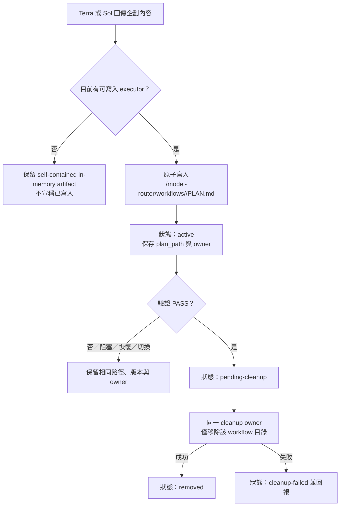

# codex-model-router

[繁體中文](README.md)｜[English](README.en.md)

安裝一套以證據為優先的 Codex 工作流程，由 Terra、Luna 與 Sol 分工，同時保留使用者選擇的主模型與其他無關的 Codex 設定。

> 路由屬於建議性機制。Codex 會讀取已安裝的代理與技能，再自行決定何時委派。本套件不攔截提示詞，也不保證強制切換模型。

## 安裝

安裝到目前專案：

```sh
npx codex-model-router@latest install
```

安裝到目前使用者：

```sh
npx codex-model-router@latest install --global
```

啟用套件管理的多代理 V2：

```sh
npx codex-model-router@latest install --v2
```

目前使用者範圍請搭配 `--global --v2`。安裝完成後重新啟動 Codex。

### Codex 安裝位置

| 範圍 | 代理定義 | 使用者技能 |
| --- | --- | --- |
| 專案 | `<專案>/.codex/agents` | `<專案>/.codex/skills` |
| 目前使用者 | `~/.codex/agents` | `~/.codex/skills` |

技能一律安裝到對應 Codex 根目錄下的 `.codex/skills/<技能名稱>`；`.codex/skills/.system` 仍保留給 Codex 內建技能。從舊版重新安裝時，套件會將受管理的 `.agents/skills` 技能安全遷移到新位置。安裝完成後，CLI 會直接顯示實際代理與技能路徑。

## 設定

```sh
npx codex-model-router@latest install \
  --terra-reasoning high \
  --luna-reasoning xhigh \
  --sol-reasoning medium \
  --terra-fast
```

| 選項 | 用途 |
| --- | --- |
| `--set-default` | 將 Terra／high 設為預設主模型 |
| `--agent-reasoning <level>` | 設定全部受管理代理的思考等級 |
| `--terra-reasoning <level>` | 設定 Terra 思考等級 |
| `--luna-reasoning <level>` | 設定 Luna 思考等級 |
| `--sol-reasoning <level>` | 設定 Sol 思考等級 |
| `--agent-fast`／`--no-agent-fast` | 對所有受管理子代理設定 Fast 偏好；個別角色選項優先 |
| `--terra-fast`／`--no-terra-fast` | 設定 Terra 的 Fast 偏好 |
| `--luna-fast`／`--no-luna-fast` | 設定 Luna 的 Fast 偏好 |
| `--sol-fast`／`--no-sol-fast` | 設定 Sol 的 Fast 偏好 |
| `--v2` | 啟用或修復套件管理的 V2 |
| `--global` | 套用到目前使用者 |

可用思考等級：`none`、`low`、`medium`、`high`、`xhigh`、`max`。

Fast 與思考等級是獨立設定，且僅保存到同一個子代理角色；不會影響主代理或其他角色。可用 `npx codex-model-router@latest status [--global]` 查看 `configured` 與 `effective`。目前 Codex 沒有每子代理 Fast 的執行階段控制，因此 `configured=true` 會明確顯示 `effective=not-supported`；安裝器不會啟用全域 `fast_mode`，也不會把 Fast 改寫成思考等級。

## 圖解說明

所有圖表預設摺疊，點擊標題後展開。

<details>
<summary><strong>角色、模型、權限與職責</strong></summary>


</details>

<details>
<summary><strong>標準主流程總覽</strong></summary>


</details>

<details>
<summary><strong>企劃檔持久化與清理流程</strong></summary>



</details>

<details>
<summary><strong>模型使用占比估算</strong></summary>


</details>

<details>
<summary><strong>流程外的主模型問答情境</strong></summary>


</details>

<details>
<summary><strong>情境 A：主模型為 Sol</strong></summary>


</details>

<details>
<summary><strong>情境 B：主模型為 Terra</strong></summary>


</details>

<details>
<summary><strong>情境 C：主模型為 Luna</strong></summary>


</details>

## 核心規則

- 同一個工作流程不重複啟動相同模型代理。
- 主模型與代理角色相同時，由主線程直接完成該角色工作。
- Luna、Terra、Sol 都具備寫入能力，但只能由升級狀態與執行旗標授權寫入；Terra 與 takeover 前 Sol 的企劃／審查只回傳內容，不寫入企劃檔。
- Terra 負責企劃與獨立驗證。
- Sol 僅在驗證結果不是 PASS 時介入。
- 最終回覆一律回到主模型。

## 工作流程恢復契約

恢復是主機消費的宣告式契約；套件不保存子代理程序，也不宣稱提供 runtime persistence。

- 狀態檔：`RECOVERY_STATE_PATH=<ARTIFACT_DIR>/recovery-state.v1.json`。
- 登錄格式：根層 `version?`、`root_session_id`、`workflow_id`、`agents`、`diagnostics?`；`agents` 是以角色為 key 的物件，不是陣列。
- 主機提供目前 primary、executor 與最多兩個有效 child roles。超過兩個回報 `EVIDENCE_GAP`，不變更狀態或採取 runtime 動作；只處理清單內角色，其他角色為 `removed-by-policy`。
- 精確且可恢復的 ID 直接 `reused`。只有主機確認實例不可用、政策允許替換且能建立新實例時才 `replaced`，並原樣保留 handoff；未知或模糊 ID 不替換。
- 主線程負責載入、atomic persistence 與協調；目前可寫入的 executor 負責 PLAN.md。寫入順序是 flush、close、rename；任何一步失敗都保留舊登錄、不發布 partial state、不執行相依動作。

## 工作流程升級狀態機

每個 task 以 `WORKFLOW_STATE_PATH=<ARTIFACT_DIR>/workflow-state.v1.json` 保存自己的狀態，與 recovery registry 分開。狀態包含版本、stage、verdict、primary、計數、執行旗標、角色 ownership 與 `blocked_reason`。同一 task 切換 primary 保留這些值；新 workflow 才重設。

四個 stage 單調前進：

1. `INITIAL`：目前 primary 確認需求；Terra 規劃/審查，啟用的 Luna 讀取/執行。
2. `SOL_REPLAN_WITH_LUNA`：Sol 修訂企劃，Luna 修正，Terra 再審查。
3. `SOL_PLAN_REVIEW_WITH_TERRA`：停用 Luna；Sol 規劃/審查，Terra 依計畫執行。
4. `SOL_FULL_TAKEOVER`：停用 Terra 執行；Sol 規劃、讀取、實作、審查並完成。

`PASS` 終止並由目前 primary 回覆；`EVIDENCE_GAP`/`REQUIREMENT_CLARIFICATION` 留在原 stage，不消耗執行次數。Primary Sol/Terra/Luna 分別不建立同模型 child；最多兩個 child，且不得在 Stage 4 重新啟用 executor。

## 企劃檔生命週期

企劃檔固定在 `<CODEX_ROOT>/model-router/workflows/<workflow_id>/PLAN.md`；每個 workflow 只使用自己的目錄。

- `INITIAL`：Terra 提供企劃，由目前可寫入的 executor 保存；Luna 為 primary 時由 primary Luna 保存，否則由 Luna child 保存。
- `SOL_REPLAN_WITH_LUNA`：Sol 提供修訂，啟用的 Luna 保存並負責清理。
- `SOL_PLAN_REVIEW_WITH_TERRA`：Sol 提供修訂，啟用的 Terra 保存並負責清理。
- `SOL_FULL_TAKEOVER`：Sol 保存並清理。
- 沒有可寫入角色時只保留 in-memory artifact，不宣稱已寫檔。

只有目前可寫入的 executor 能原子寫入或更新 PLAN.md；reviewer 不寫檔。`PASS` 後由同一 cleanup owner 移除該 workflow 目錄。阻塞、恢復、替換與 primary switch 保留路徑、版本與 owner；清理失敗保存為 `cleanup-failed`。

## V2 行為

```text
install --v2  → 啟用 V2；已追蹤的標記區塊被修改或遺失時自動修復
install       → 停用未被修改的套件管理 V2
uninstall     → 移除路由器與未被修改的受管理 V2
```

再次明確執行 `install --v2` 時，若套件狀態仍存在且套件標記內的 V2 內容被修改或整個受管理區塊遺失，安裝器會重建該標記區塊、更新雜湊並保留其他 TOML。既有未受管理、缺少狀態、標記不完整或標記重複的 V2 設定仍會保留並停止操作，避免誤覆寫。

## 移除

從目前專案移除：

```sh
npx codex-model-router@latest uninstall
```

從目前使用者移除：

```sh
npx codex-model-router@latest uninstall --global
```

## 安全性

- 保留無關的 TOML、註解、BOM、排序與 LF／CRLF。
- 使用路徑驗證、範圍鎖定、原子交易與回滾。
- 除了明確執行 `install --v2` 時重建套件標記的 V2 區塊，不覆寫其他使用者修改的受管理檔案。
- 不修改 `AGENTS.md`、Shell Profile、編輯器設定、Hooks、MCP 伺服器、帳號、遙測或環境變數。

## 系統需求

- Node.js 18 以上。
- 支援自訂代理與本機技能的 Codex。
- 可使用 `gpt-5.6-terra`、`gpt-5.6-luna` 與 `gpt-5.6-sol`。
- Windows、Linux 或 macOS。

安全性問題請參閱 [SECURITY.md](SECURITY.md)。維護者發佈流程請參閱 [MAINTAINERS.md](MAINTAINERS.md)。
