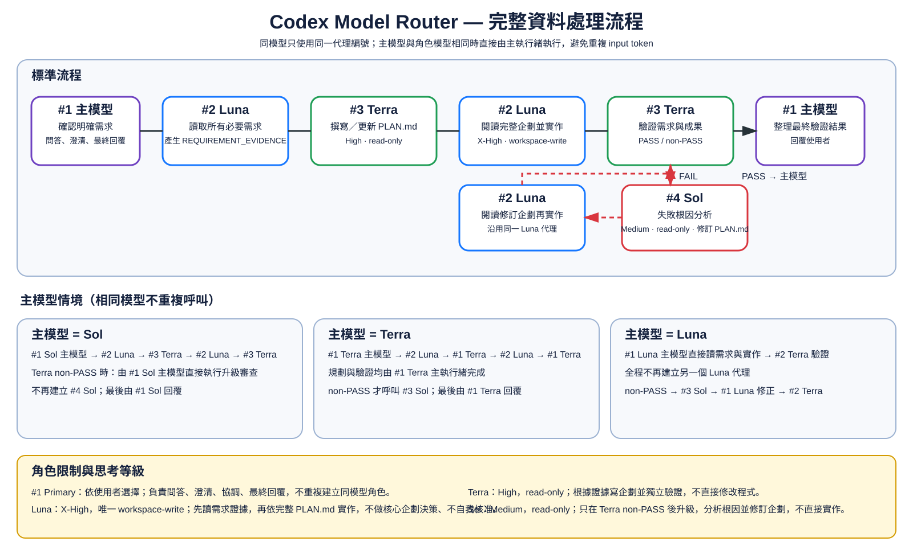

# codex-model-router

Installs an evidence-first Codex workflow for Terra, Luna, and Sol while preserving the user's primary model and unrelated Codex configuration.

> Routing is advisory. Codex reads the installed agents and skills and decides when to delegate. This package does not intercept prompts or guarantee a hard model switch.

## Install

From the project root:

```sh
npx codex-model-router@latest install
```

Install for the current user instead:

```sh
npx codex-model-router@latest install --global
```

Restart Codex after installation. Running `install` again safely updates recognized package-managed templates while preserving user-modified files.

## Configuration

Normal installation keeps the current primary model unchanged.

Set Terra/high as the primary default:

```sh
npx codex-model-router@latest install --set-default
```

Set reasoning for all managed agents:

```sh
npx codex-model-router@latest install --agent-reasoning high
```

Set agents individually:

```sh
npx codex-model-router@latest install \
  --terra-reasoning high \
  --luna-reasoning xhigh \
  --sol-reasoning medium
```

Supported reasoning values: `none`, `low`, `medium`, `high`, `xhigh`, `max`.

Options can be combined with `--global`.

## Remove

Remove the project installation:

```sh
npx codex-model-router@latest uninstall
```

Remove the user installation:

```sh
npx codex-model-router@latest uninstall --global
```

Only unchanged package-managed files and settings are removed. User-modified files and unrelated configuration are preserved.

## Workflow



For nontrivial code changes:

```text
Primary model confirms the requirement
→ Luna reads requirements, rules, relevant code, callers, and dependencies
→ Luna returns one self-contained REQUIREMENT_EVIDENCE package
→ Terra writes or updates PLAN.md
→ the same Luna role reads the complete plan and implements it
→ Terra verifies requirement satisfaction and plan conformance
→ PASS returns the verified result to the primary model
→ non-PASS escalates to Sol
→ Sol diagnoses the failure and revises affected PLAN.md sections
→ the same Luna role reimplements the affected scope
→ Terra performs final verification
→ the primary model replies to the user
```

The full workflow is not started for ordinary questions, explanations, read-only analysis, or unclear requirements. The primary model handles those cases directly and asks for clarification before code-changing work when necessary.

## Roles

| Role | Model | Default reasoning | Access | Responsibility |
| --- | --- | --- | --- | --- |
| Primary | User selected | User selected | Existing setting | Conversation, clarification, coordination, final reply |
| Luna | `gpt-5.6-luna` | `xhigh` | `workspace-write` | Requirement evidence and implementation |
| Terra | `gpt-5.6-terra` | `high` | `read-only` | Planning and independent verification |
| Sol | `gpt-5.6-sol` | `medium` | `read-only` | Failed-verification analysis and plan revision |

Luna is the only writable role. Luna cannot make architecture decisions or self-approve. Terra and Sol never edit implementation files.

### No duplicate same-model agents

One model uses one stable role identity throughout a workflow:

- Luna primary: performs Luna reading and implementation in the primary thread.
- Terra primary: performs Terra planning and verification in the primary thread.
- Sol primary: performs Sol escalation and replanning in the primary thread.
- A matching-model subagent is never spawned again for a later stage.
- Unknown primary identity is not guessed: use one Luna agent, one Terra agent, and only after non-PASS one Sol agent.

This reduces repeated context transfer and input-token usage.

## Planning and verification

Luna records confirmed requirements, constraints, files, symbols, current and required behavior, direct flow, invariants, unknowns, and evidence locations.

Terra marks plan information as `CONFIRMED`, `PROPOSED`, or `UNKNOWN`. Implementation cannot start while an unknown can change behavior, targets, contracts, parameter flow, control flow, callers, or compatibility.

Terra returns one verdict:

- `PASS`
- `FAIL_IMPLEMENTATION`
- `FAIL_PLAN`
- `EVIDENCE_GAP`
- `REQUIREMENT_CLARIFICATION`

Any non-PASS result includes evidence for Sol. One correction loop is preferred, with at most three implementation-verification cycles unless new evidence or a changed user decision appears.

## Managed files

```text
.codex/config.toml                              # only with --set-default
.codex/agents/terra.toml
.codex/agents/luna.toml
.codex/agents/sol.toml
.codex/model-router-state.json
.codex/config.toml.codex-model-router.bak       # only when needed
.agents/skills/model-router/SKILL.md
.agents/skills/implementation-planning/SKILL.md
```

## Safety

- Preserves unrelated TOML settings, comments, BOM, ordering, and LF/CRLF.
- Rejects malformed, non-UTF-8, unsafe, symlinked, or junction-redirected managed paths.
- Uses scope locking, atomic transactions, rollback, and conflict-safe recovery.
- Restores package-managed primary settings during uninstall when unchanged.
- Never overwrites user-modified managed files.
- Never changes `AGENTS.md`, shell profiles, editor settings, hooks, MCP servers, telemetry, accounts, or environment variables.

## Requirements

- Node.js 18 or newer.
- Codex with custom-agent and local-skill support.
- Access to `gpt-5.6-terra`, `gpt-5.6-luna`, and `gpt-5.6-sol`.
- Windows, Linux, or macOS.

Security issues: see [SECURITY.md](SECURITY.md). Maintainer release steps: see [MAINTAINERS.md](MAINTAINERS.md).
