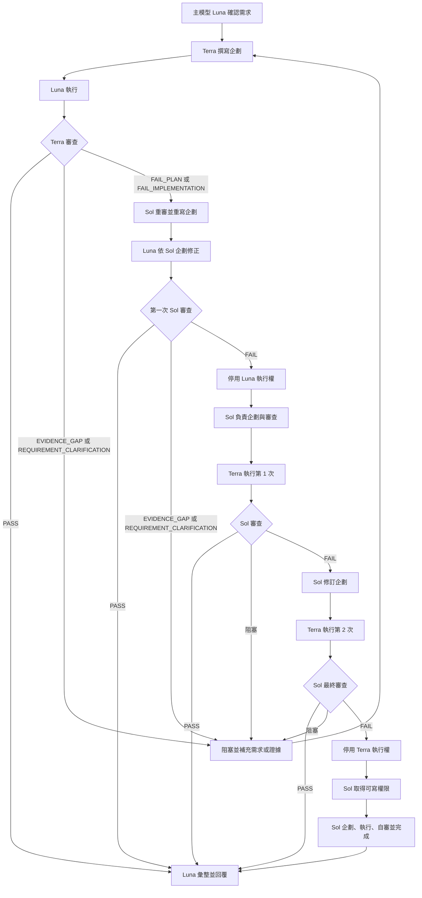
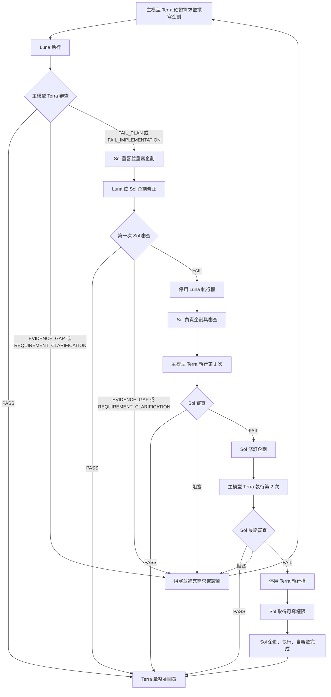
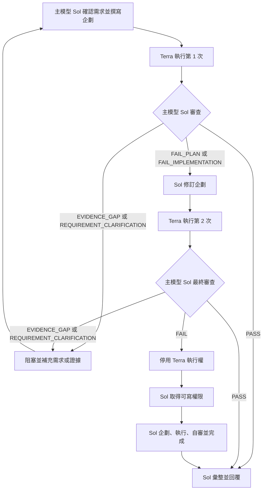

# 主模型審查升級流程

本文件定義 `luna`、`terra`、`sol` 作為主模型時的審查、修正與最終接管流程。

## 全域規則

1. 主模型始終負責需求確認、流程協調與最終回覆。
2. 每個任務最多只能同時存在 **2 個子代理**。
3. 子代理模型不得與主模型重複；相同模型的角色由主執行緒直接承擔。
4. 同一模型只能有一個持續角色，不得重新建立第二個同模型代理。
5. `PASS` 立即結束流程。
6. `EVIDENCE_GAP` 或 `REQUIREMENT_CLARIFICATION` 進入阻塞狀態，不計入執行失敗次數，也不得直接停用執行者。
7. `FAIL_PLAN` 或 `FAIL_IMPLEMENTATION` 才計入審查失敗。
8. 第一次 `Sol` 審查失敗後，永久停用本次任務的 `Luna` 執行權。
9. `Luna` 停用後，由 `Sol` 負責企劃與審查，`Terra` 最多執行 2 次。
10. 第二次 `Terra` 執行完成後仍未通過 `Sol` 審查，永久停用本次任務的 `Terra` 執行權，後續由 `Sol` 負責企劃、執行與審查。
11. 「停用主模型執行權」只代表該主模型不得再修改檔案；主執行緒仍保留協調與最終回覆責任。
12. `Sol` 在一般企劃與審查階段保持唯讀；進入最終接管狀態後必須取得可寫權限。

## 共用狀態

| 狀態 | 初始值 | 上限或規則 |
|---|---:|---|
| `active_child_agents` | 依主模型決定 | `<= 2` |
| `sol_review_failures` | `0` | 第一次失敗停用 Luna |
| `terra_execution_attempts` | `0` | 最多 `2` 次 |
| `luna_execution_enabled` | `true` | 停用後不得恢復 |
| `terra_execution_enabled` | `true` | 停用後不得恢復 |
| `sol_full_takeover` | `false` | Terra 第二次失敗後改為 `true` |

## 主模型 Luna

### 角色配置

| 角色 | 模型 | 執行位置 |
|---|---|---|
| 主模型、需求整理、初始執行者 | Luna | 主執行緒 |
| 初始企劃與初始審查 | Terra | 子代理 1 |
| 升級企劃、升級審查、最終接管 | Sol | 子代理 2 |
| Luna 停用後的執行者 | Terra | 重用子代理 1 |

子代理總數：`Terra + Sol = 2`。



### 升級順序

```text
Terra 企劃／審查 + Luna 執行
  -> Terra 審查失敗
Sol 重寫企劃 + Luna 修正 + Sol 審查
  -> 第一次 Sol 審查失敗
停用 Luna
Sol 企劃／審查 + Terra 執行最多 2 次
  -> 第二次 Terra 完成後仍失敗
停用 Terra
Sol 全權完成
```

## 主模型 Terra

### 角色配置

| 角色 | 模型 | 執行位置 |
|---|---|---|
| 主模型、初始企劃、初始審查 | Terra | 主執行緒 |
| 初始需求整理與執行者 | Luna | 子代理 1 |
| 升級企劃、升級審查、最終接管 | Sol | 子代理 2 |
| Luna 停用後的執行者 | Terra | 主執行緒 |

子代理總數：`Luna + Sol = 2`。



### 升級順序

```text
Terra 主模型企劃／審查 + Luna 執行
  -> Terra 審查失敗
Sol 重寫企劃 + Luna 修正 + Sol 審查
  -> 第一次 Sol 審查失敗
停用 Luna
Sol 企劃／審查 + Terra 主模型執行最多 2 次
  -> 第二次 Terra 完成後仍失敗
停用 Terra 的執行權
Sol 全權完成，Terra 主模型只負責協調與最終回覆
```

## 主模型 Sol

### 角色配置

| 角色 | 模型 | 執行位置 |
|---|---|---|
| 主模型、需求整理、企劃、審查 | Sol | 主執行緒 |
| 一般執行者 | Terra | 子代理 1 |
| 最終接管執行者 | Sol | 主執行緒 |

子代理總數：`Terra = 1`。

主模型已是最高審查層，因此不建立 Luna 子代理，也不建立額外 Sol 子代理。



### 升級順序

```text
Sol 主模型企劃／審查 + Terra 執行第 1 次
  -> Sol 審查失敗
Sol 修訂企劃 + Terra 執行第 2 次
  -> 第二次 Terra 完成後仍失敗
停用 Terra
Sol 主模型全權完成
```

## 審查結果處理表

| 審查結果 | 處理方式 | 是否增加失敗次數 |
|---|---|---:|
| `PASS` | 結束並由主模型回覆 | 否 |
| `FAIL_IMPLEMENTATION` | 保留已驗證內容，修正實作 | 是 |
| `FAIL_PLAN` | 重寫受影響企劃後重新執行 | 是 |
| `EVIDENCE_GAP` | 補證據後回到原階段 | 否 |
| `REQUIREMENT_CLARIFICATION` | 停止執行並釐清需求 | 否 |

## 不允許的流程

- 同時建立兩個 Luna、兩個 Terra 或兩個 Sol。
- 主模型是 Luna 時再建立 Luna 子代理。
- 主模型是 Terra 時再建立 Terra 子代理。
- 主模型是 Sol 時再建立 Sol 子代理。
- 第一次 Sol 審查失敗後重新啟用 Luna 執行。
- Terra 第二次執行失敗後重新啟用 Terra 執行。
- Sol 尚未進入最終接管狀態時直接修改檔案。
- 因證據不足或需求不明而消耗實作重試次數。
